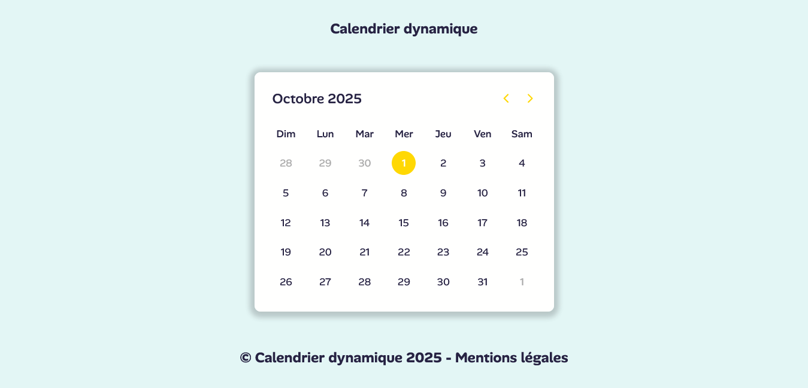

## CALENDRIER DYNAMIQUE EN HTML5 CSS3 ET JAVASCRIPT 📅

## Le challenge

Création d'un calendrier dynamique en HTML5, CSS3 et JavaScript.

## Démonstration

Lien vers le projet : https://aperbet56.github.io/calendrier_dynamique/

## Projet développé avec

- Utilisation des balises sémantiques HTML5
- CSS3
- Flexbox
- Animation CSS (transition)
- Page web responsive
- Utilisation d'un normaliseur: le fichier normalize.css
- Importation de la police "Alan Sans"
- Desktop first
- Commentaires HTML
- Commentaires CSS
- JavaScript
- Code JavaScript commenté
